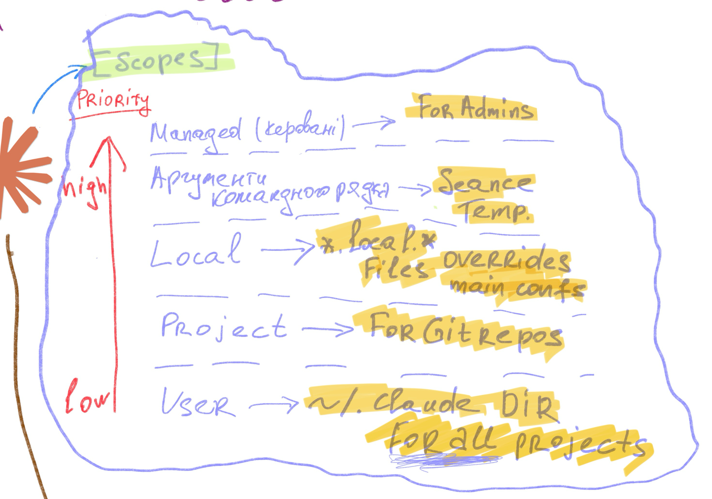
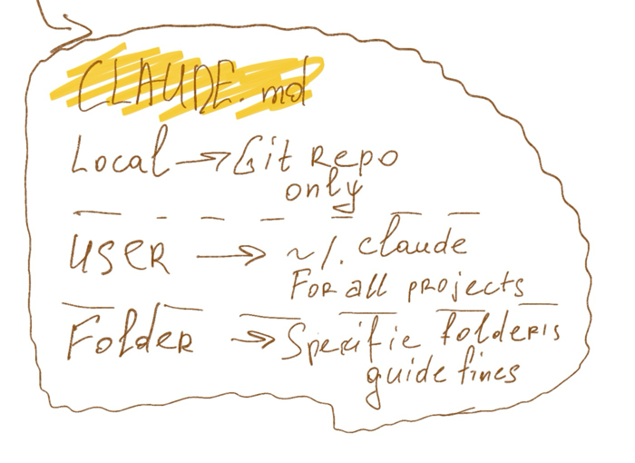
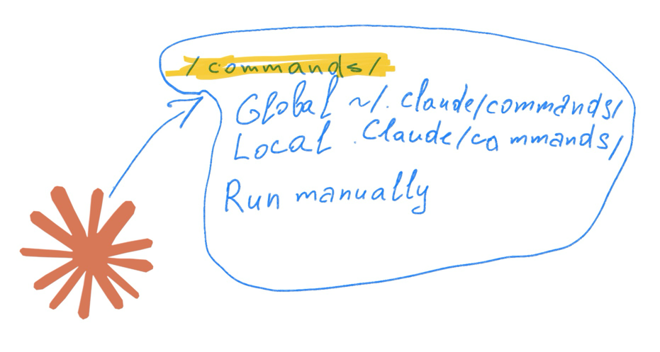

# Claude Code Configuration for Laravel Projects

A comprehensive, production-ready Claude Code configuration for Laravel + Inertia.js + Vue 3 projects. Includes 18 specialized agents, 5 rule files, 27 skills, and a structured workflow pipeline that turns Claude Code into a full AI development team.

**Stack:** PHP 8.4 · Laravel 12 · Vue 3 · Inertia.js v2 · PostgreSQL 17 · Redis · Docker · Pest 4

## What's Included

### Agents (18)

Specialized AI agents that handle different aspects of development:

| Agent | Purpose | Model |
|-------|---------|-------|
| `ba` | Business analysis, requirements, user stories | opus |
| `ci-cd-engineer` | GitHub Actions, CI/CD pipelines | sonnet |
| `dba` | Database design, migrations, query optimization | sonnet |
| `ddd-architect` | Domain modeling, business logic placement | opus |
| `debugger` | Bug investigation, root-cause analysis | sonnet |
| `developer` | Full-stack Laravel + Inertia.js features | opus |
| `devil` | Devil's advocate in planning phase, challenges requirements and architecture | opus |
| `devops` | Docker, deployment, infrastructure | sonnet |
| `docs-writer` | Technical documentation, README, API docs | sonnet |
| `filament` | Filament v4 admin panel resources | opus |
| `frontend` | Vue 3 components, Pinia, Tailwind, a11y | opus |
| `integration-architect` | OAuth, webhooks, third-party services | sonnet |
| `laravel-refactoring-expert` | Refactoring, N+1 fixes, code quality | opus |
| `qa` | E2E testing, Playwright, visual regression | opus |
| `queue-specialist` | Redis queues, jobs, async processing | sonnet |
| `reviewer` | Code review, architecture audit | opus |
| `security-scanner` | OWASP, auth/authz, credential leaks | opus |
| `tester` | Unit/feature tests, Pest, mutation testing | opus |

### Rules (5)

Auto-loaded rules that enforce project conventions:

| Rule | Purpose |
|------|---------|
| `architecture.md` | Actions pattern, Inertia.js, domain organization |
| `code-style.md` | PHP 8.4 strict types, Eloquent conventions, Pint/PHPStan/Rector |
| `git-operations.md` | Commit/push safety, PR description format |
| `testing.md` | Pest 4, mutation testing, model testing policy |
| `workflow.md` | Agent pipeline orchestration |

### Skills (27)

Reusable knowledge modules organized by category:

**Laravel & PHP:** `laravel-specialist`, `laravel-coder`, `laravel-architecture`, `php-pro`

**Testing:** `pest-testing`, `test-master`, `playwright-expert`, `playwright-skill`

**Database:** `database-optimizer`, `postgresql`, `postgresql-optimization`, `postgres-best-practices`

**Architecture:** `architecture-designer`, `ddd-strategic-design`, `code-reviewer`, `architect-review`

**DevOps:** `devops`, `docker-expert`, `github-actions`, `github-actions-templates`

**Debugging & Security:** `debugging-wizard`, `security-reviewer`

**API & Frontend:** `api-design-principles`, `vue-expert`, `vue-expert-js`

**Planning:** `plan-writing`, `brainstorming`

### Workflow Pipeline

The configuration defines a mandatory agent pipeline for feature development:

```
Standard Feature:  Planning Team → Developer → Quality Gate Team → DocsWriter
Bug Fix:           Debugger → Developer → Verify Team
CI/CD:             DevOps / CI-CD Engineer → Reviewer + Security Scanner
```

**Planning Team** (`plan-{slug}`) runs `ba`, `ddd-architect`, and `devil` in parallel. `devil` is a read-only devil's advocate that challenges requirements and architecture decisions via SendMessage before any code is written. For simple features with no arch decisions, `ba` runs sequentially alone.

**Quality Gate Team** (`qg-{slug}`) runs `tester`, `reviewer`, `security-scanner`, and `qa` in parallel via TeamCreate. If any agent reports a Critical or Important issue, findings route back to Developer and the team reruns.

## Prerequisites

- [Claude Code](https://code.claude.com) CLI installed
- Node.js 18+ (for skills installation via `npx`)
- A Laravel project (ideally with Docker)

## Quick Start

### Step 1: Copy Configuration

Clone this repository and copy the configuration files into your Laravel project:

```bash
# Clone the config repo
git clone https://github.com/AlexGritsworker/claude-laravel.git /tmp/claude-laravel-config

# Copy into your project
cp -r /tmp/claude-laravel-config/.claude /path/to/your-laravel-project/
cp /tmp/claude-laravel-config/CLAUDE.md /path/to/your-laravel-project/
```

Or add as a git subtree/submodule if you prefer to track updates.

> **Agent Teams**: `settings.json` already includes `CLAUDE_CODE_EXPERIMENTAL_AGENT_TEAMS=1` which enables parallel Quality Gate and Verify Team execution. This is an experimental feature — requires Claude Code with agent teams support.

### Step 2: Install Superpowers Plugin

[Superpowers](https://github.com/obra/superpowers) provides structured development workflows: brainstorming, planning, TDD, debugging, code review, and more.

Run inside Claude Code:

```
/plugin marketplace add obra/superpowers-marketplace
/plugin install superpowers@superpowers-marketplace
```

**Skills provided:** brainstorming, writing-plans, executing-plans, test-driven-development, systematic-debugging, requesting-code-review, verification-before-completion, using-git-worktrees, subagent-driven-development, finishing-a-development-branch

### Step 3: Install Claude HUD Plugin

[Claude HUD](https://github.com/jarrodwatts/claude-hud) adds a real-time statusline showing model, context usage, active tools, running agents, and task progress.

**Requires:** Claude Code v1.0.80+, Node.js 18+

Run inside Claude Code:

```
/plugin marketplace add jarrodwatts/claude-hud
/plugin install claude-hud
/claude-hud:setup
```

Customize display with `/claude-hud:configure` (choose Full, Essential, or Minimal preset).

### Step 4: Install Mytets Plugin (Optional)

[Mytets](https://github.com/rrader/mytets) adds a Ukrainian theatrical communication style inspired by Les Podervyansky. Activate with `/mytets:mytets-mode`.

Run inside Claude Code:

```
/plugin marketplace add rrader/mytets
/plugin install mytets
```

### Step 5: Install Additional Skills from skills.sh

The configuration already includes 27 project skills in `.claude/skills/`. To install additional community skills from [skills.sh](https://skills.sh):

```bash
npx skills add <owner/repo>
```

Browse the [skills.sh leaderboard](https://skills.sh) to discover popular skills. Examples:

```bash
# Install a specific skill set
npx skills add vercel-labs/skills

# Install with options
npx skills add <owner/repo> -a claude-code
```

### `CLAUDE.md`

The main instructions file. Adapt this to your project:

1. Update system requirements if your stack differs
2. Adjust Docker commands to match your `compose.yml`
3. Add project-specific rules in the "Core Principles" section
4. Modify the agent list if you add/remove agents

## Customization

### Add a New Agent

Create `.claude/agents/my-agent.md`:

```yaml
---
name: my-agent
description: "What this agent does. Trigger words — EN: keyword1, keyword2. Trigger words — UA: слово1, слово2."
model: sonnet
color: blue
---

# Agent Title

Instructions for the agent...
```

### Add a New Rule

Create `.claude/rules/my-rule.md` with markdown content. Rules are auto-loaded for every conversation.

### Add a New Skill

Create `.claude/skills/my-skill/SKILL.md`:

```yaml
---
name: my-skill
description: What this skill does and when to use it
---

Instructions Claude follows when this skill is active...
```

See the [Claude Code Skills documentation](https://code.claude.com/docs/en/skills) for advanced features: supporting files, subagent execution, dynamic context injection.

### Bilingual Agent Support

All agents include trigger words in both English and Ukrainian. To add another language, extend the `description` field in the YAML frontmatter:

```
Trigger words — EN: keyword1, keyword2.
Trigger words — UA: слово1, слово2.
Trigger words — DE: schlüsselwort1, schlüsselwort2.
```

## Architecture Overview

This configuration follows the **Laravel Actions** pattern (`lorisleiva/laravel-actions`):

| Layer | Pattern |
|-------|---------|
| HTTP entry | Page Actions (`AsController`) |
| Form handling | Store/Update Actions (`AsController`) |
| Business logic | Business Actions (`AsObject`) |
| Authorization | Policies |
| Validation | Form Requests |
| Side effects | Observers |
| Value objects | Enums |
| Async work | Jobs (`ShouldQueue`) |
| Cross-cutting | Events / Listeners |

No traditional Controllers, no Repository pattern, no `app/Domain/` directory.


## Few Claude Code Structure





## License

MIT
